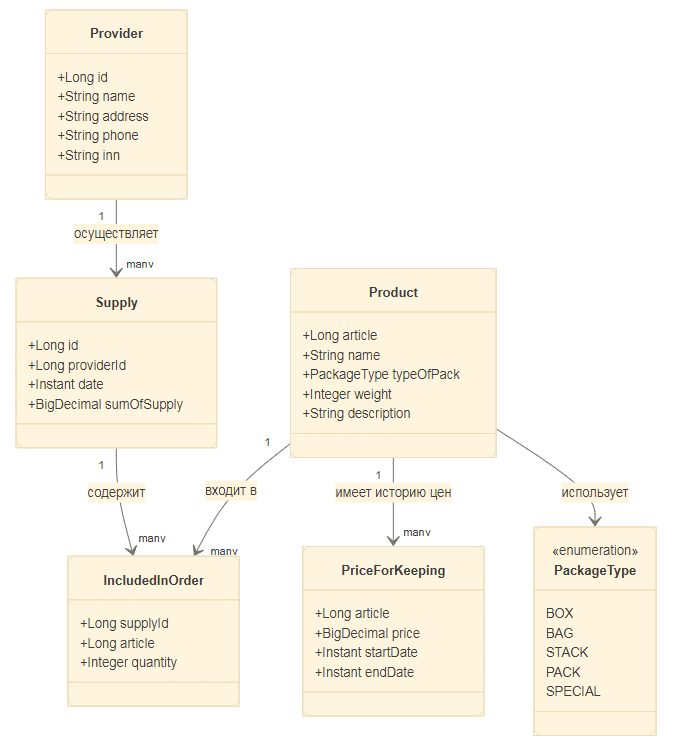
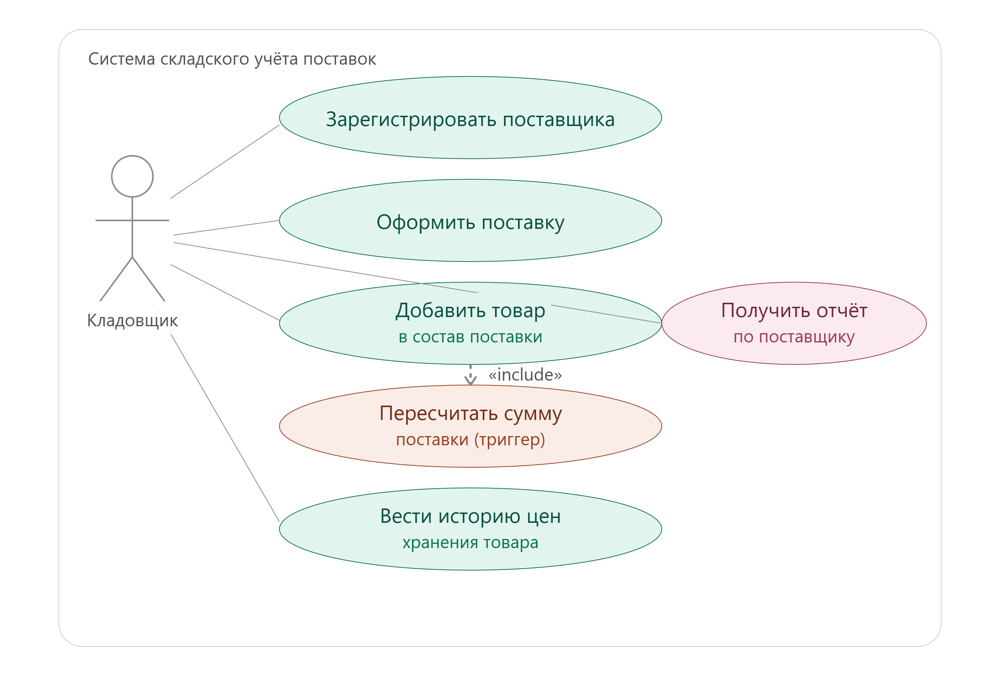
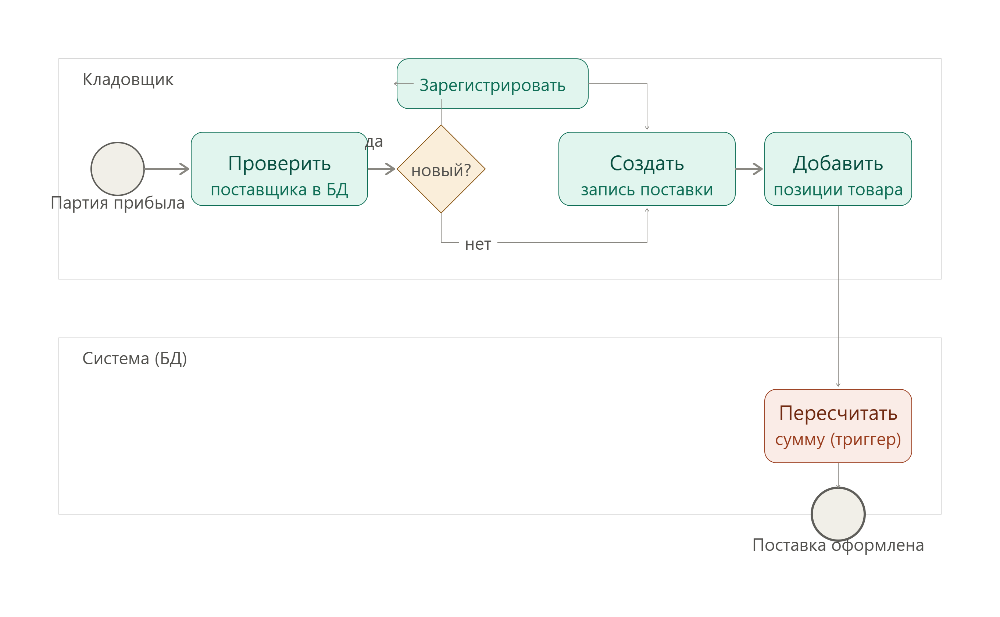

# Warehouse API 
Учебный проект: API складского учёта поставок продукции.

Доменная модель и логика перенесены из лабораторных работ по дисциплине
«Базы данных» (MySQL) на стек Spring Boot + JPA/Hibernate +
PostgreSQL. 

Основа проекта - учебная университетская работа по созданию базы данных, ее UML диаграммы, соответствующих сущностей и доработок в процессе
усложнения условий, например добавление тригера на пересчет стоимости поставки в случае изменения цены товара и тп.
Оригинальные отчеты по этому проекту(1 курс ИИТММ) можно найти в папке отчёты.

## Проектирование

Перед написанием кода предметная область была формализована через UML
и BPMN — диаграммы построены на основе сущностей и связей из исходной
схемы БД (см. раздел «Происхождение и история изменений» ниже).

**Диаграмма классов** 



**Диаграмма прецедентов (use case):**



**BPMN-диаграмма процесса оформления поставки:**



## Происхождение и история изменений

Исходная схема (MySQL):

```
provider (ID_PROVIDER, NAME, ADRESS, PHONE, INN)
product  (ARTICLE, NAME, type_of_pack ENUM, WEIGHT, DISCRIPTION)
supply   (ID_SUPPLY, ID_PROVIDER, DATE)
included_in_order (ord_id, article, quantity)   -- связь m:n
price_for_keeping  (article, price, start_date, end_date)
```
## Стек

- Java 17, Spring Boot 3.3.4
- Spring Data JPA (Hibernate)
- PostgreSQL
- Maven

## Структура проекта

```
src/main/java/com/smirnov/warehouse/
├── model/        — JPA-сущности (Provider, Product, Supply, IncludedInOrder, PriceForKeeping)
├── repository/   — интерфейсы Spring Data JPA
├── service/      — бизнес-логика
├── controller/   — REST-контроллеры
└── dto/          — объекты передачи данных для запросов/ответов API

src/main/resources/
├── application.yml — конфигурация подключения к БД
├── schema.sql       — DDL: таблицы, enum, триггер, функция
└── data.sql         — тестовые данные 
```

## Запуск локально

Предварительно нужны: JDK 17+, Maven, запущенный PostgreSQL.

1. Создать базу данных:
   ```sql
   CREATE DATABASE warehouse;
   ```

2. При необходимости поправить `src/main/resources/application.yml`
   (логин/пароль/порт PostgreSQL, если отличаются от значений по умолчанию
   `postgres` / `postgres` / `5432`).

3. Собрать и запустить:
   ```bash
   mvn spring-boot:run
   ```

   При старте Spring Boot автоматически выполнит `schema.sql` (создаст
   таблицы, ENUM-тип, триггер и функцию) и `data.sql` (заполнит тестовыми
   данными) — это включено опцией `spring.sql.init.mode: always`
   в application.yml.

4. Приложение поднимется на `http://localhost:8080`.

## Эндпоинты API

| Метод | Путь | Описание |
|---|---|---|
| POST | `/api/supplies` | создать поставку. Тело: `{"providerId": 1}` |
| GET | `/api/supplies/{id}` | получить поставку по id |
| GET | `/api/supplies?providerId=1` | список поставок поставщика |
| POST | `/api/supplies/{id}/items` | добавить товар в поставку. Тело: `{"article": 5, "quantity": 3}` — запускает триггер пересчёта суммы |
| GET | `/api/providers/{providerId}/most-popular-product` | самый закупаемый товар у поставщика (вызов PL/pgSQL-функции) |

### Пример проверки триггера

```bash
# Создать поставку у поставщика с id=1
curl -X POST http://localhost:8080/api/supplies \
  -H "Content-Type: application/json" \
  -d '{"providerId": 1}'
# Ответ: {"id": 7, "providerName": "ИП Грызлов", "supplyDate": "...", "sumOfSupply": 0.00}

# Добавить товар (article=1, quantity=2) в поставку id=7
curl -X POST http://localhost:8080/api/supplies/7/items \
  -H "Content-Type: application/json" \
  -d '{"article": 1, "quantity": 2}'

# Проверить, что sumOfSupply пересчитался триггером
curl http://localhost:8080/api/supplies/7
# sumOfSupply должен стать quantity * актуальная_цена_на_момент_запроса
```

## Что не реализовано

- Нет аутентификации/авторизации
- VIEW из ЛР (`QUANTITY_INFO`, `VNAME1`) не перенесены как отдельные
  REST-эндпоинты — их смысл (агрегация по товару, отчёт по поставке)
  покрывается комбинацией существующих эндпоинтов и прямых SQL-запросов
  к БД; добавление выделенных эндпоинтов под них — естественное
  направление для дальнейшего расширения проекта.
